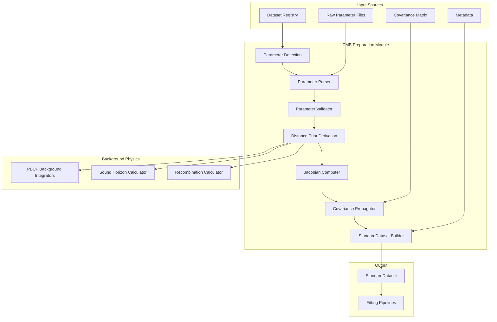

# Design Document

## Overview

The CMB Raw Parameter Integration feature extends the existing CMB preparation module to process raw Planck-style cosmological parameters and derive distance priors internally. This design maintains backward compatibility while adding sophisticated parameter processing, covariance propagation, and validation capabilities.

The architecture integrates seamlessly with the existing data preparation framework, dataset registry, and fitting pipelines without requiring changes to downstream components.

## Architecture



## Components and Interfaces

### 1. Parameter Detection Engine

**Location:** `pipelines/data_preparation/derivation/cmb_derivation.py`

**Purpose:** Automatically detect and classify CMB parameter files from registry entries.

**Key Functions:**
```python
def detect_raw_parameters(registry_entry: RegistryEntry) -> Optional[RawParameterInfo]:
    """Detect if registry entry contains raw cosmological parameters."""
    
def classify_parameter_format(file_path: str) -> ParameterFormat:
    """Determine if file is CSV, JSON, or NumPy format."""
    
def validate_parameter_completeness(params: Dict) -> ValidationResult:
    """Check if all required parameters are present."""
```

**Implementation Details:**
- Scans registry metadata for `"dataset_type": "cmb"` tags
- Supports multiple file formats: CSV, JSON, NumPy (.npz)
- Uses fuzzy matching for parameter names (case-insensitive, underscore variations)
- Returns structured information about detected parameters and their locations

### 2. Parameter Parser

**Purpose:** Read and normalize raw cosmological parameters from various file formats.

**Key Functions:**
```python
def parse_parameter_file(file_path: str, format_type: ParameterFormat) -> ParameterSet:
    """Parse parameter file and return normalized parameter dictionary."""
    
def normalize_parameter_names(raw_params: Dict) -> Dict:
    """Map various parameter name conventions to standard names."""
    
def extract_covariance_matrix(file_path: str) -> np.ndarray:
    """Extract parameter covariance matrix from file or companion file."""
```

**Parameter Name Mapping:**
```python
PARAMETER_ALIASES = {
    'H0': ['H0', 'h0', 'hubble', 'H_0', 'h_0'],
    'Omega_m': ['Omega_m', 'Om0', 'omega_m', 'OmegaM', 'Ωm'],
    'Omega_b_h2': ['Omega_b_h2', 'omegabh2', 'omega_b_h2', 'Ωbh²'],
    'n_s': ['n_s', 'ns', 'n_scalar', 'spectral_index'],
    'tau': ['tau', 'τ', 'tau_reio', 'optical_depth'],
    'A_s': ['A_s', 'As', 'A_scalar', 'scalar_amplitude']
}
```

### 3. Parameter Validator

**Purpose:** Validate parameter values against physical constraints and numerical sanity.

**Key Functions:**
```python
def validate_parameter_ranges(params: ParameterSet) -> ValidationResult:
    """Check parameters against physical bounds."""
    
def check_numerical_stability(params: ParameterSet) -> ValidationResult:
    """Verify no NaN, inf, or extreme values."""
    
def validate_covariance_matrix(cov: np.ndarray) -> ValidationResult:
    """Check covariance matrix properties."""
```

**Validation Rules:**
```python
PARAMETER_BOUNDS = {
    'H0': (50.0, 80.0),           # km/s/Mpc
    'Omega_m': (0.1, 0.5),        # Matter density
    'Omega_b_h2': (0.01, 0.05),   # Baryon density
    'n_s': (0.9, 1.1),            # Spectral index
    'tau': (0.01, 0.15),          # Optical depth
    'A_s': (1e-10, 5e-9)          # Scalar amplitude
}
```

### 4. Distance Prior Derivation Engine

**Purpose:** Compute CMB distance priors from raw cosmological parameters using PBUF background integrators.

**Key Functions:**
```python
def compute_distance_priors(params: ParameterSet, z_recomb: float = 1089.8) -> DistancePriors:
    """Compute R, ℓ_A, θ* from cosmological parameters."""
    
def compute_shift_parameter(params: ParameterSet, z_recomb: float) -> float:
    """Compute R = √(Ωm H₀²) × r(z*)/c"""
    
def compute_acoustic_scale(params: ParameterSet, z_recomb: float) -> float:
    """Compute ℓ_A = π × r(z*)/r_s(z*)"""
    
def compute_angular_scale(params: ParameterSet, z_recomb: float) -> float:
    """Compute θ* = r_s(z*)/r(z*)"""
```

**Integration with PBUF Background:**
```python
# Use existing background integrators
from core.pbuf_background import BackgroundIntegrator
from core.pbuf_models import compute_sound_horizon

def integrate_comoving_distance(params: ParameterSet, z: float) -> float:
    """Integrate comoving distance using PBUF integrators."""
    integrator = BackgroundIntegrator(params)
    return integrator.comoving_distance(z)

def compute_sound_horizon_at_recombination(params: ParameterSet, z_recomb: float) -> float:
    """Compute sound horizon at recombination."""
    return compute_sound_horizon(params, z_recomb)
```

### 5. Jacobian Computer

**Purpose:** Numerically compute derivatives of distance priors with respect to input parameters for covariance propagation.

**Key Functions:**
```python
def compute_jacobian(params: ParameterSet, z_recomb: float, step_size: float = 1e-6) -> np.ndarray:
    """Compute ∂(R,ℓ_A,θ*)/∂(p_i) numerically."""
    
def finite_difference_derivative(func: Callable, params: ParameterSet, param_name: str, 
                               step_size: float) -> float:
    """Compute numerical derivative using central differences."""
    
def optimize_step_size(func: Callable, params: ParameterSet, param_name: str) -> float:
    """Automatically determine optimal step size for numerical differentiation."""
```

**Numerical Implementation:**
```python
def compute_jacobian(params: ParameterSet, z_recomb: float, step_size: float = 1e-6) -> np.ndarray:
    """
    Compute Jacobian matrix J[i,j] = ∂(observable_i)/∂(param_j)
    
    Observables: [R, ℓ_A, Ω_b h², θ*]
    Parameters: [H0, Ω_m, Ω_b h², n_s, τ, A_s]
    """
    n_obs = 4  # R, ℓ_A, Ω_b h², θ*
    param_names = list(params.keys())
    n_params = len(param_names)
    
    jacobian = np.zeros((n_obs, n_params))
    
    for j, param_name in enumerate(param_names):
        # Central difference: f'(x) ≈ [f(x+h) - f(x-h)] / (2h)
        params_plus = params.copy()
        params_minus = params.copy()
        
        h = step_size * abs(params[param_name])
        params_plus[param_name] += h
        params_minus[param_name] -= h
        
        priors_plus = compute_distance_priors(params_plus, z_recomb)
        priors_minus = compute_distance_priors(params_minus, z_recomb)
        
        jacobian[:, j] = (priors_plus.values - priors_minus.values) / (2 * h)
    
    return jacobian
```

### 6. Covariance Propagator

**Purpose:** Transform parameter covariance matrix to derived observable covariance using Jacobian.

**Key Functions:**
```python
def propagate_covariance(param_cov: np.ndarray, jacobian: np.ndarray) -> np.ndarray:
    """Compute C_derived = J × C_params × J^T"""
    
def validate_covariance_properties(cov: np.ndarray) -> ValidationResult:
    """Check symmetry and positive-definiteness."""
    
def compute_correlation_matrix(cov: np.ndarray) -> np.ndarray:
    """Convert covariance to correlation matrix for analysis."""
```

**Mathematical Implementation:**
```python
def propagate_covariance(param_cov: np.ndarray, jacobian: np.ndarray) -> np.ndarray:
    """
    Propagate parameter uncertainties to derived observables.
    
    Formula: C_derived = J × C_params × J^T
    
    Args:
        param_cov: Parameter covariance matrix (n_params × n_params)
        jacobian: Jacobian matrix (n_obs × n_params)
    
    Returns:
        Derived covariance matrix (n_obs × n_obs)
    """
    # Validate input dimensions
    n_obs, n_params = jacobian.shape
    assert param_cov.shape == (n_params, n_params)
    
    # Compute propagated covariance
    derived_cov = jacobian @ param_cov @ jacobian.T
    
    # Validate result properties
    validation = validate_covariance_properties(derived_cov)
    if not validation.is_valid:
        raise ValueError(f"Invalid derived covariance: {validation.errors}")
    
    return derived_cov
```

### 7. StandardDataset Builder

**Purpose:** Create StandardDataset output compatible with existing fitting pipelines.

**Key Functions:**
```python
def build_standard_dataset(priors: DistancePriors, cov: np.ndarray, 
                          metadata: Dict) -> StandardDataset:
    """Create StandardDataset from derived priors and covariance."""
    
def create_metadata(params: ParameterSet, processing_info: Dict) -> Dict:
    """Generate comprehensive metadata for provenance tracking."""
    
def validate_output_format(dataset: StandardDataset) -> ValidationResult:
    """Ensure output matches expected StandardDataset schema."""
```

**Output Schema:**
```python
@dataclass
class StandardDataset:
    z: np.ndarray                    # [z_recombination] 
    observable: np.ndarray           # [R, ℓ_A, Ω_b h², θ*]
    uncertainty: np.ndarray          # √(diagonal(covariance))
    covariance: np.ndarray           # Full covariance matrix
    metadata: Dict                   # Processing provenance
    
# Example output structure:
StandardDataset(
    z=np.array([1089.8]),
    observable=np.array([1.7502, 301.845, 0.02237, 1.04092]),
    uncertainty=np.array([0.0023, 0.091, 0.00015, 0.00031]),
    covariance=cov_matrix_4x4,
    metadata={
        "dataset_type": "cmb",
        "source": "planck2018_raw_parameters",
        "processing": "derived from raw cosmological parameters",
        "citation": "Planck Collaboration 2020",
        "parameters_used": ["H0", "Omega_m", "Omega_b_h2", "n_s", "tau"],
        "z_recombination": 1089.8,
        "derivation_method": "pbuf_background_integrators",
        "jacobian_step_size": 1e-6,
        "validation_passed": True,
        "processing_timestamp": "2024-10-24T12:00:00Z"
    }
)
```

## Data Models

### Parameter Set Structure
```python
@dataclass
class ParameterSet:
    H0: float                        # Hubble constant [km/s/Mpc]
    Omega_m: float                   # Matter density parameter
    Omega_b_h2: float               # Baryon density × h²
    n_s: float                      # Scalar spectral index
    tau: float                      # Optical depth to reionization
    A_s: Optional[float] = None     # Scalar amplitude (if available)
    
    def to_dict(self) -> Dict[str, float]:
        """Convert to dictionary for processing."""
        
    def validate(self) -> ValidationResult:
        """Validate parameter values against physical bounds."""
```

### Distance Priors Structure
```python
@dataclass
class DistancePriors:
    R: float                        # Shift parameter
    l_A: float                      # Acoustic scale
    Omega_b_h2: float              # Baryon density (pass-through)
    theta_star: float              # Angular scale
    
    @property
    def values(self) -> np.ndarray:
        """Return as array for numerical operations."""
        return np.array([self.R, self.l_A, self.Omega_b_h2, self.theta_star])
```

### Configuration Schema
```python
@dataclass
class CMBConfig:
    use_raw_parameters: bool = True          # Enable raw parameter processing
    z_recombination: float = 1089.8         # Recombination redshift
    jacobian_step_size: float = 1e-6       # Numerical differentiation step
    validation_tolerance: float = 1e-8      # Covariance validation tolerance
    fallback_to_legacy: bool = True         # Auto-fallback if raw params unavailable
    cache_computations: bool = True         # Cache expensive computations
    
    def validate(self) -> ValidationResult:
        """Validate configuration parameters."""
```

## Error Handling

### Exception Hierarchy
```python
class CMBProcessingError(Exception):
    """Base exception for CMB processing errors."""
    
class ParameterDetectionError(CMBProcessingError):
    """Raised when raw parameters cannot be detected or parsed."""
    
class ParameterValidationError(CMBProcessingError):
    """Raised when parameters fail validation checks."""
    
class DerivationError(CMBProcessingError):
    """Raised when distance prior computation fails."""
    
class CovarianceError(CMBProcessingError):
    """Raised when covariance propagation fails."""
    
class NumericalInstabilityError(CMBProcessingError):
    """Raised when numerical computations become unstable."""
```

### Error Recovery Strategy
```python
def process_cmb_dataset(registry_entry: RegistryEntry, config: CMBConfig) -> StandardDataset:
    """Main processing function with comprehensive error handling."""
    try:
        # Attempt raw parameter processing
        raw_params = detect_raw_parameters(registry_entry)
        if raw_params is None:
            if config.fallback_to_legacy:
                return process_legacy_distance_priors(registry_entry)
            else:
                raise ParameterDetectionError("No raw parameters found")
        
        # Process raw parameters
        params = parse_parameter_file(raw_params.file_path, raw_params.format)
        validation = validate_parameter_ranges(params)
        if not validation.is_valid:
            raise ParameterValidationError(f"Invalid parameters: {validation.errors}")
        
        # Compute distance priors
        priors = compute_distance_priors(params, config.z_recombination)
        
        # Propagate covariance
        if raw_params.covariance_file:
            param_cov = extract_covariance_matrix(raw_params.covariance_file)
            jacobian = compute_jacobian(params, config.z_recombination, config.jacobian_step_size)
            derived_cov = propagate_covariance(param_cov, jacobian)
        else:
            # Use diagonal uncertainties if no covariance available
            derived_cov = create_diagonal_covariance(priors, params)
        
        # Build output dataset
        return build_standard_dataset(priors, derived_cov, create_metadata(params, config))
        
    except (ParameterDetectionError, ParameterValidationError) as e:
        if config.fallback_to_legacy:
            logger.warning(f"Raw parameter processing failed, falling back to legacy: {e}")
            return process_legacy_distance_priors(registry_entry)
        else:
            raise
    
    except (DerivationError, CovarianceError, NumericalInstabilityError) as e:
        logger.error(f"CMB processing failed: {e}")
        raise
```

## Testing Strategy

### Unit Tests

**Parameter Detection Tests:**
```python
def test_detect_planck_parameters():
    """Test detection of Planck-style parameter files."""
    
def test_parameter_name_mapping():
    """Test fuzzy matching of parameter names."""
    
def test_format_classification():
    """Test automatic format detection (CSV/JSON/NumPy)."""
```

**Derivation Tests:**
```python
def test_distance_prior_computation():
    """Test R, ℓ_A, θ* computation against known values."""
    
def test_numerical_accuracy():
    """Verify derived priors match published Planck results within 1σ."""
    
def test_parameter_sensitivity():
    """Test derivative computation accuracy."""
```

**Covariance Tests:**
```python
def test_jacobian_computation():
    """Test numerical Jacobian against analytical derivatives where possible."""
    
def test_covariance_propagation():
    """Test uncertainty propagation maintains statistical properties."""
    
def test_matrix_validation():
    """Test covariance matrix symmetry and positive-definiteness checks."""
```

### Integration Tests

**End-to-End Pipeline:**
```python
def test_full_pipeline_with_mock_planck_data():
    """Test complete pipeline from registry entry to StandardDataset."""
    
def test_backward_compatibility():
    """Ensure legacy distance-prior mode still works."""
    
def test_fitting_pipeline_integration():
    """Verify StandardDataset works with existing fitting code."""
```

**Performance Tests:**
```python
def test_processing_performance():
    """Ensure processing completes within acceptable time limits."""
    
def test_memory_usage():
    """Monitor memory consumption during processing."""
    
def test_numerical_stability():
    """Test behavior with extreme parameter values."""
```

## Integration Points

### Dataset Registry Integration
- Registry entries must include parameter file metadata
- Support for multiple file formats in single entry
- Covariance matrix linking and validation
- Provenance tracking through processing chain

### Fitting Pipeline Integration
- StandardDataset output maintains exact compatibility
- No changes required in `fit_cmb.py` or likelihood functions
- Metadata provides processing transparency
- Error handling preserves existing behavior

### Background Physics Integration
- Uses existing PBUF background integrators
- Consistent with BAO and SN distance calculations
- Shared physical constants and methods
- Validated against existing implementations

## Deployment Strategy

### Phase 1: Core Implementation
1. Implement parameter detection and parsing
2. Add distance prior derivation using existing integrators
3. Create basic covariance propagation
4. Ensure backward compatibility

### Phase 2: Advanced Features
1. Add sophisticated Jacobian computation
2. Implement comprehensive validation
3. Add performance optimizations and caching
4. Enhance error handling and diagnostics

### Phase 3: Production Deployment
1. Complete integration testing
2. Performance benchmarking
3. Documentation and user guides
4. Gradual rollout with monitoring

### Configuration Management
```python
# Default configuration for production
CMB_CONFIG = {
    "use_raw_parameters": True,
    "z_recombination": 1089.8,
    "jacobian_step_size": 1e-6,
    "validation_tolerance": 1e-8,
    "fallback_to_legacy": True,
    "cache_computations": True,
    "performance_monitoring": True
}
```

This design provides a robust, scientifically accurate, and maintainable implementation of CMB raw parameter processing while preserving full backward compatibility with existing systems.