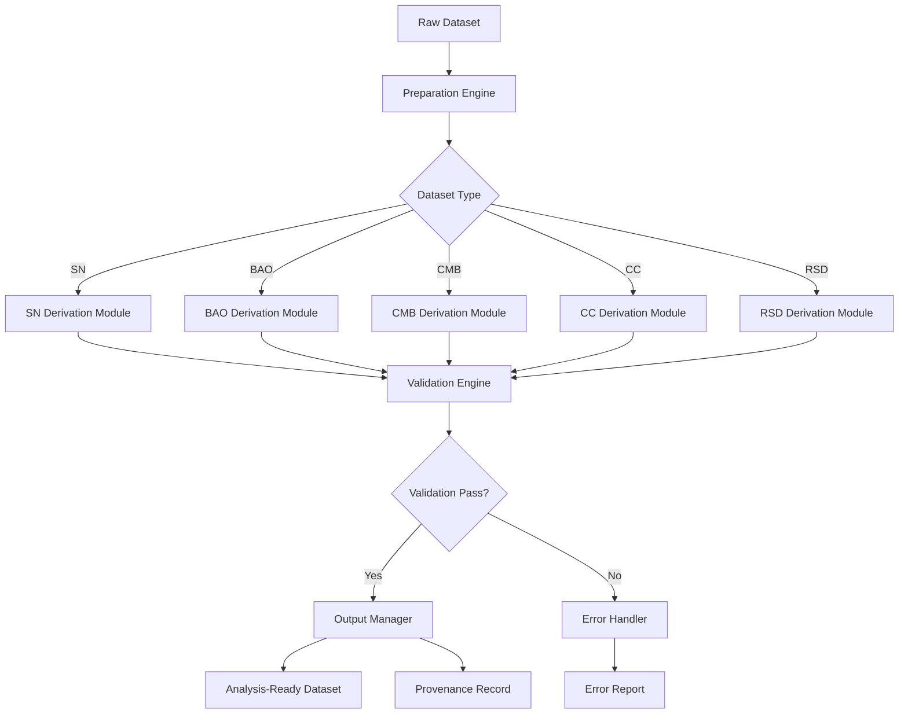

# Design Document

## Overview

The PBUF Data Preparation & Derivation Framework provides a unified layer between the existing dataset registry and fitting pipelines, transforming raw cosmological datasets into standardized, analysis-ready formats. The framework extends the current PBUF infrastructure by introducing systematic data processing, validation, and provenance tracking for all dataset types.

The framework operates as a middleware component that consumes verified raw datasets from the Central Dataset Downloader & Verification Registry and produces standardized datasets compatible with the existing `pipelines/fit_core/datasets.py` interface, ensuring seamless integration with current fitting workflows.

### Scope and Boundaries

This framework governs all data transformation and validation processes between verified raw downloads and analysis-ready datasets. It does not alter cosmological model logic or fitting algorithms.

## Architecture

### System Context

```
[Raw Data Sources] → [Dataset Registry] → [Data Preparation Framework] → [Fit Pipelines]
                                                     ↓
                                            [Provenance Registry]
```

The framework sits between the existing dataset registry (which handles download and verification) and the fit pipelines (which perform cosmological analysis), providing the missing data standardization layer.

### Core Components

#### 1. Preparation Engine (`preparation_engine.py`)
- **Purpose**: Orchestrates the entire data preparation workflow
- **Responsibilities**: 
  - Coordinates dataset loading from registry
  - Dispatches to appropriate derivation modules
  - Manages validation pipeline
  - Handles error recovery and logging

#### 2. Derivation Modules (`derivation/`)
- **Purpose**: Dataset-specific transformation logic
- **Structure**: Plugin-based architecture with modules for each dataset type
  - `sn_derivation.py` - Supernova data processing
  - `bao_derivation.py` - BAO isotropic/anisotropic processing  
  - `cmb_derivation.py` - CMB distance priors processing
  - `cc_derivation.py` - Cosmic Chronometers processing
  - `rsd_derivation.py` - RSD growth rate processing

#### 3. Validation Engine (`validation_engine.py`)
- **Purpose**: Multi-stage validation of processed datasets
- **Capabilities**:
  - Schema compliance checking
  - Numerical integrity validation
  - Covariance matrix validation
  - Physical consistency checks

#### 4. Registry Integration (`registry_integration.py`)
- **Purpose**: Interface with existing dataset registry and provenance system
- **Functions**:
  - Retrieve verified raw datasets
  - Register derived datasets with provenance
  - Query dataset metadata and verification status

#### 5. Output Manager (`output_manager.py`)
- **Purpose**: Standardized output generation and storage
- **Responsibilities**:
  - Generate analysis-ready datasets in standard format
  - Create provenance records
  - Handle file I/O and format conversion

### Data Flow Architecture



## Components and Interfaces

### Standard Dataset Schema

All derived datasets conform to a unified internal schema:

```python
@dataclass
class StandardDataset:
    """Standardized dataset format (analysis-ready dataset) for all cosmological data types"""
    z: np.ndarray              # Redshift array
    observable: np.ndarray     # Measured quantities (μ, D_M/r_d, H(z), etc.)
    uncertainty: np.ndarray    # One-sigma uncertainties
    covariance: Optional[np.ndarray]  # Full covariance matrix (N×N or None)
    metadata: Dict[str, Any]   # Source, citation, processing info
    
    # Validation methods
    def validate_schema(self) -> bool
    def validate_numerical(self) -> bool
    def validate_covariance(self) -> bool
```

### Derivation Module Interface

Each dataset type implements a common interface:

```python
class DerivationModule(ABC):
    """Abstract base class for dataset-specific derivation modules"""
    
    @abstractmethod
    def derive(self, raw_data: Path, metadata: Dict) -> StandardDataset:
        """Transform raw data to standard format"""
        pass
    
    @abstractmethod
    def validate_input(self, raw_data: Path) -> bool:
        """Validate raw data before processing"""
        pass
    
    @abstractmethod
    def get_transformation_summary(self) -> Dict[str, Any]:
        """Return summary of applied transformations"""
        pass
```### Int

### Integration with Existing Systems

#### Dataset Registry Integration

The framework integrates with the existing `RegistryManager` class:

```python
class DataPreparationFramework:
    def __init__(self, registry_manager: RegistryManager):
        self.registry = registry_manager
        self.derivation_modules = self._load_derivation_modules()
    
    def prepare_dataset(self, dataset_name: str) -> StandardDataset:
        # 1. Retrieve verified raw data from registry
        raw_entry = self.registry.get_registry_entry(dataset_name)
        
        # 2. Dispatch to appropriate derivation module
        module = self._get_derivation_module(dataset_name)
        derived_dataset = module.derive(raw_entry.file_info["local_path"])
        
        # 3. Validate derived dataset
        self._validate_dataset(derived_dataset)
        
        # 4. Register derived dataset with provenance
        self._register_derived_dataset(dataset_name, derived_dataset)
        
        return derived_dataset
```

Each derived dataset registry entry SHALL include references to its source registry entry hashes and the environment snapshot created by the freeze-environment utility.
```

#### Fit Pipeline Integration

The framework maintains compatibility with existing `datasets.py` interface:

```python
# Existing interface in fit_core/datasets.py
def load_dataset(name: str) -> DatasetDict:
    # Enhanced to use preparation framework when available
    if _is_preparation_framework_enabled():
        return _load_from_preparation_framework(name)
    else:
        return _load_dataset_legacy(name)

def _load_from_preparation_framework(name: str) -> DatasetDict:
    framework = DataPreparationFramework(registry_manager)
    standard_dataset = framework.prepare_dataset(name)
    
    # Convert to existing DatasetDict format for compatibility
    return {
        "observations": standard_dataset.observable,
        "uncertainties": standard_dataset.uncertainty,
        "covariance": standard_dataset.covariance,
        "redshifts": standard_dataset.z,
        "metadata": standard_dataset.metadata
    }
```

## Data Models

### Dataset Type Specifications

#### Supernova (SN) Processing
- **Input**: Raw magnitude data with systematic corrections
- **Transformations**:
  - Remove duplicate entries by coordinate matching
  - Homogenize calibration systems (SALT2, MLCS2k2)
  - Convert apparent magnitudes to distance modulus
  - Apply systematic covariance matrices
- **Output**: `z`, `μ(z)`, `σ_μ`, covariance matrix

#### BAO Processing  
- **Input**: Distance measurements from galaxy surveys
- **Transformations**:
  - Separate isotropic (D_V/r_d) and anisotropic (D_M/r_d, D_H/r_d) measurements
  - Convert distance measures to consistent units (Mpc)
  - Validate correlation matrices
  - Handle survey-specific systematic corrections
- **Output**: `z`, `D_V/r_d` or `[D_M/r_d, D_H/r_d]`, uncertainties, covariance

#### CMB Processing
- **Input**: Planck distance priors (R, l_A, θ_*)
- **Transformations**:
  - Extract compressed parameters from Planck chains
  - Validate dimensionless consistency
  - Apply appropriate covariance matrix
- **Output**: `z_*`, `[R, l_A, θ_*]`, uncertainties, covariance

#### Cosmic Chronometers (CC) Processing
- **Input**: H(z) measurements from stellar chronometry
- **Transformations**:
  - Merge compilations from multiple sources
  - Filter overlapping redshift bins
  - Propagate systematic uncertainties
  - Validate H(z) sign conventions
- **Output**: `z`, `H(z)`, `σ_H`, covariance (if available)

#### RSD Processing
- **Input**: Growth rate measurements (fσ₈)
- **Transformations**:
  - Validate growth rate sign conventions
  - Homogenize covariance from published sources
  - Apply survey-specific corrections
- **Output**: `z`, `fσ₈(z)`, `σ_{fσ₈}`, covariance## Err
or Handling

### Validation Failure Recovery

The framework implements a multi-tier error handling strategy:

1. **Input Validation Failures**
   - Log detailed error with dataset context
   - Attempt alternative data sources if available
   - Fallback to manual intervention workflow

2. **Transformation Failures**
   - Capture transformation state at failure point
   - Generate diagnostic reports with intermediate results
   - Enable partial recovery for multi-step transformations

3. **Output Validation Failures**
   - Detailed validation report with specific failure reasons
   - Comparison with expected ranges/values
   - Automatic retry with adjusted parameters if applicable

### Error Reporting

```python
@dataclass
class ProcessingError:
    """Comprehensive error reporting for data preparation failures"""
    dataset_name: str
    stage: str  # "input_validation", "transformation", "output_validation"
    error_type: str
    error_message: str
    context: Dict[str, Any]
    suggested_actions: List[str]
    timestamp: str
    
    def generate_report(self) -> str:
        """Generate human-readable error report"""
        pass
```

## Testing Strategy

### Unit Testing
- **Derivation Modules**: Test each transformation step with known inputs/outputs
- **Validation Engine**: Test all validation rules with edge cases
- **Schema Compliance**: Verify output format consistency

### Integration Testing  
- **Registry Integration**: Test data retrieval and provenance recording
- **Fit Pipeline Integration**: Verify compatibility with existing `load_dataset()` interface
- **End-to-End Workflows**: Test complete preparation pipeline for each dataset type

### Validation Testing
- **Round-trip Tests**: Verify deterministic behavior with identical inputs. The system SHALL produce identical checksums for derived datasets when re-run with identical inputs and environment hashes
- **Cross-validation**: Compare outputs with existing legacy loaders during transition
- **Performance Tests**: Ensure processing times meet operational requirements

### Test Data Strategy
- **Synthetic Datasets**: Generated test data with known properties for validation
- **Reference Datasets**: Subset of real data with pre-computed expected outputs  
- **Edge Cases**: Malformed data, missing fields, extreme values

## Performance Considerations

The framework SHALL prepare all Phase A datasets (CMB, SN, BAO iso/aniso) within a defined reference runtime on baseline hardware, without altering numerical outputs.

### Processing Optimization
- **Lazy Loading**: Load raw datasets only when needed
- **Caching**: Cache derived datasets to avoid reprocessing
- **Parallel Processing**: Process independent datasets concurrently (deterministically)

### Memory Management
- **Streaming Processing**: Handle large datasets without loading entirely into memory
- **Chunked Operations**: Process covariance matrices in blocks for memory efficiency
- **Resource Monitoring**: Track memory usage and provide warnings for large datasets

### Scalability
- **Modular Architecture**: Add new dataset types without performance impact on existing ones
- **Configuration-driven**: Adjust processing parameters based on system resources
- **Graceful Degradation**: Reduce processing complexity for resource-constrained environments

## Security and Validation

### Data Integrity
- **Checksum Validation**: Verify data integrity throughout processing pipeline
- **Immutable Provenance**: Ensure transformation history cannot be modified
- **Audit Trails**: Complete logging of all data transformations

### Input Sanitization
- **Schema Validation**: Strict validation of input data formats
- **Range Checking**: Validate physical quantities are within reasonable bounds
- **Injection Prevention**: Sanitize any user-provided metadata or configuration

This design provides a robust, extensible framework that integrates seamlessly with existing PBUF infrastructure while establishing the foundation for standardized, reproducible cosmological data preparation.