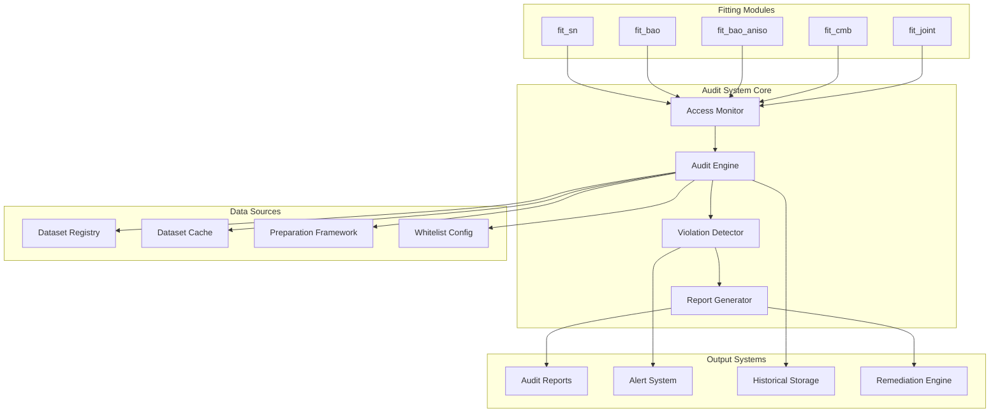

# Dataset Isolation Audit Design

## Overview

The Dataset Isolation Audit system implements a comprehensive security and integrity framework that monitors, validates, and enforces strict dataset access controls across all fitting modules in the PBUF cosmology pipeline. The system operates through a multi-layered architecture that combines real-time monitoring, registry integration, cache validation, and automated reporting.

The design leverages existing infrastructure (dataset registry, preparation framework) while adding new audit-specific components for violation detection, provenance tracking, and compliance reporting. The system is designed to be minimally invasive, adding less than 5% performance overhead while providing comprehensive security coverage.

## Architecture

### High-Level Architecture



### Component Architecture

The system consists of four main architectural layers:

1. **Monitoring Layer**: Intercepts and tracks dataset access operations
2. **Validation Layer**: Enforces whitelist rules and validates provenance
3. **Analysis Layer**: Detects violations and generates insights
4. **Reporting Layer**: Produces audit reports and remediation suggestions

## Components and Interfaces

### 1. Audit Engine (`pipelines/audit/core/audit_engine.py`)

**Purpose**: Central orchestrator that coordinates all audit operations and maintains system state.

**Key Methods**:
```python
class AuditEngine:
    def start_audit_session(self, modules: List[str]) -> AuditSession
    def register_access_monitor(self, monitor: AccessMonitor) -> None
    def validate_dataset_access(self, module: str, dataset: str) -> ValidationResult
    def generate_audit_report(self, session_id: str) -> AuditReport
    def get_violation_summary(self) -> ViolationSummary
```

**Interfaces**:
- `IAuditEngine`: Core audit operations interface
- `IViolationHandler`: Handles violation detection and response
- `IReportGenerator`: Generates various report formats

### 2. Access Monitor (`pipelines/audit/monitoring/access_monitor.py`)

**Purpose**: Real-time monitoring of dataset access patterns across all fitting modules.

**Key Methods**:
```python
class AccessMonitor:
    def intercept_dataset_load(self, module: str, dataset_path: str) -> AccessRecord
    def track_cache_access(self, module: str, cache_key: str) -> CacheRecord
    def monitor_registry_queries(self, dataset_id: str) -> RegistryRecord
    def start_module_monitoring(self, module_name: str) -> MonitoringSession
```

**Integration Points**:
- Hooks into `fit_core.datasets.load_dataset()`
- Monitors `dataset_registry` access patterns
- Tracks `data_preparation` framework usage

### 3. Whitelist Manager (`pipelines/audit/validation/whitelist_manager.py`)

**Purpose**: Manages and enforces dataset access whitelists for each fitting module.

**Key Methods**:
```python
class WhitelistManager:
    def load_module_whitelist(self, module: str) -> Set[str]
    def validate_access(self, module: str, dataset: str) -> bool
    def get_allowed_datasets(self, module: str) -> List[str]
    def update_whitelist(self, module: str, datasets: List[str]) -> None
```

**Whitelist Configuration**:
```yaml
# pipelines/audit/config/dataset_whitelists.yaml
module_whitelists:
  fit_sn:
    allowed_datasets: ["sn_pantheon_plus"]
    strict_mode: true
  fit_bao:
    allowed_datasets: ["bao_dr16_isotropic"]
    strict_mode: true
  fit_bao_aniso:
    allowed_datasets: ["bao_dr16_anisotropic"]
    strict_mode: true
  fit_cmb:
    allowed_datasets: ["cmb_planck2018_distance_priors"]
    strict_mode: true
  fit_joint:
    allowed_datasets: 
      - "cmb_planck2018_distance_priors"
      - "sn_pantheon_plus"
      - "bao_dr16_isotropic"
      - "bao_dr16_anisotropic"
    strict_mode: true
```

### 4. Provenance Validator (`pipelines/audit/validation/provenance_validator.py`)

**Purpose**: Validates dataset registry entries, checksums, and provenance chains.

**Key Methods**:
```python
class ProvenanceValidator:
    def validate_registry_entry(self, dataset_id: str) -> RegistryValidation
    def verify_checksum(self, dataset_path: str, expected_hash: str) -> bool
    def check_provenance_isolation(self, datasets: List[str]) -> ProvenanceReport
    def validate_dataset_integrity(self, dataset_id: str) -> IntegrityResult
```

### 5. Cache Validator (`pipelines/audit/validation/cache_validator.py`)

**Purpose**: Detects and prevents cache contamination between fitting modules.

**Key Methods**:
```python
class CacheValidator:
    def scan_cache_directories(self) -> CacheInventory
    def validate_cache_ownership(self, cache_key: str, module: str) -> bool
    def detect_cross_module_access(self) -> List[CacheViolation]
    def clean_contaminated_cache(self, violations: List[CacheViolation]) -> None
```

### 6. Violation Detector (`pipelines/audit/analysis/violation_detector.py`)

**Purpose**: Analyzes access patterns and detects various types of violations.

**Key Methods**:
```python
class ViolationDetector:
    def detect_unauthorized_access(self, records: List[AccessRecord]) -> List[Violation]
    def identify_cross_references(self, access_patterns: AccessPatterns) -> List[Warning]
    def analyze_cache_contamination(self, cache_records: List[CacheRecord]) -> List[Violation]
    def generate_violation_report(self) -> ViolationReport
```

**Violation Types**:
```python
class ViolationType(Enum):
    UNEXPECTED_DATASET_ACCESS = "violation: unexpected dataset access"
    POTENTIAL_CROSS_REFERENCE = "warning: potential cross-reference"
    CACHE_CONTAMINATION = "cache contamination"
    MISSING_REGISTRY_ENTRY = "missing registry validation"
    CHECKSUM_MISMATCH = "checksum verification failure"
```

### 7. Report Generator (`pipelines/audit/reporting/report_generator.py`)

**Purpose**: Generates comprehensive audit reports in multiple formats.

**Key Methods**:
```python
class ReportGenerator:
    def generate_compliance_report(self, session: AuditSession) -> ComplianceReport
    def create_violation_summary(self, violations: List[Violation]) -> ViolationSummary
    def export_audit_data(self, format: str) -> str
    def generate_remediation_suggestions(self, violations: List[Violation]) -> RemediationPlan
```

## Data Models

### Core Data Structures

```python
@dataclass
class AccessRecord:
    timestamp: datetime
    module_name: str
    dataset_id: str
    dataset_path: str
    registry_hash: Optional[str]
    access_type: AccessType  # LOAD, CACHE_HIT, REGISTRY_QUERY
    success: bool
    
@dataclass
class Violation:
    violation_type: ViolationType
    module_name: str
    dataset_id: str
    description: str
    severity: Severity  # CRITICAL, WARNING, INFO
    timestamp: datetime
    remediation_suggestion: Optional[str]

@dataclass
class AuditSession:
    session_id: str
    start_time: datetime
    end_time: Optional[datetime]
    modules_audited: List[str]
    total_accesses: int
    violations_found: int
    status: AuditStatus  # RUNNING, COMPLETED, FAILED

@dataclass
class ComplianceReport:
    session_id: str
    audit_timestamp: datetime
    overall_status: str  # "All fit modules confirmed isolated" or detailed violations
    modules_passed: List[str]
    modules_with_violations: List[str]
    dataset_access_summary: Dict[str, List[str]]
    violation_details: List[Violation]
    remediation_plan: RemediationPlan
```

### Registry Integration Models

```python
@dataclass
class RegistryValidation:
    dataset_id: str
    registry_exists: bool
    checksum_valid: bool
    provenance_clean: bool
    last_verified: datetime
    
@dataclass
class ProvenanceReport:
    datasets_checked: List[str]
    shared_provenance_detected: bool
    isolation_violations: List[str]
    provenance_chains: Dict[str, List[str]]
```

## Error Handling

### Error Categories and Responses

1. **Critical Violations**: Unauthorized dataset access
   - **Response**: Immediate alert, execution halt option, detailed logging
   - **Recovery**: Automatic remediation suggestions, manual intervention required

2. **Warning Conditions**: Potential cross-references, cache anomalies
   - **Response**: Warning logs, continued monitoring, trend analysis
   - **Recovery**: Automated cleanup where possible, preventive recommendations

3. **System Errors**: Registry unavailable, monitoring failures
   - **Response**: Graceful degradation, fallback validation, error reporting
   - **Recovery**: Retry mechanisms, alternative validation paths

### Error Handling Strategy

```python
class AuditErrorHandler:
    def handle_registry_unavailable(self) -> FallbackStrategy
    def handle_monitoring_failure(self, module: str) -> RecoveryAction
    def handle_violation_detection_error(self, error: Exception) -> ErrorResponse
    def escalate_critical_violation(self, violation: Violation) -> EscalationAction
```

## Testing Strategy

### Unit Testing Approach

1. **Component Isolation Testing**
   - Mock dataset access operations
   - Simulate violation scenarios
   - Test whitelist enforcement logic
   - Validate report generation accuracy

2. **Integration Testing**
   - End-to-end audit workflows
   - Registry integration validation
   - Cache contamination detection
   - Multi-module concurrent auditing

3. **Performance Testing**
   - Overhead measurement during fitting operations
   - Scalability testing with multiple datasets
   - Memory usage validation during large audits
   - Response time benchmarking

### Test Data and Scenarios

```python
# Test scenarios for comprehensive coverage
TEST_SCENARIOS = {
    "clean_isolation": {
        "modules": ["fit_sn", "fit_bao"],
        "expected_violations": 0,
        "datasets_accessed": {"fit_sn": ["sn_pantheon_plus"], "fit_bao": ["bao_dr16_isotropic"]}
    },
    "unauthorized_access": {
        "modules": ["fit_sn"],
        "injected_access": "bao_dr16_isotropic",
        "expected_violations": 1,
        "violation_type": "UNEXPECTED_DATASET_ACCESS"
    },
    "cache_contamination": {
        "modules": ["fit_sn", "fit_bao"],
        "contaminated_cache": "fit_sn_cache_accessed_by_fit_bao",
        "expected_violations": 1,
        "violation_type": "CACHE_CONTAMINATION"
    }
}
```

### Continuous Integration Testing

- **Pre-commit hooks**: Validate audit system integrity
- **CI pipeline integration**: Run audit tests on all PRs
- **Regression testing**: Ensure new features don't break isolation
- **Performance benchmarking**: Track overhead metrics over time

## Implementation Phases

### Phase 1: Core Infrastructure (Week 1-2)
- Implement AuditEngine and AccessMonitor
- Create basic whitelist management
- Establish monitoring hooks in fit_core.datasets

### Phase 2: Validation Systems (Week 3-4)
- Implement ProvenanceValidator and CacheValidator
- Integrate with existing dataset registry
- Add violation detection logic

### Phase 3: Reporting and Analysis (Week 5-6)
- Build ReportGenerator and ViolationDetector
- Create audit report templates
- Implement remediation suggestion engine

### Phase 4: Integration and Testing (Week 7-8)
- Full system integration testing
- Performance optimization
- Documentation and user guides

This design provides a robust, scalable foundation for ensuring dataset isolation while maintaining system performance and usability.