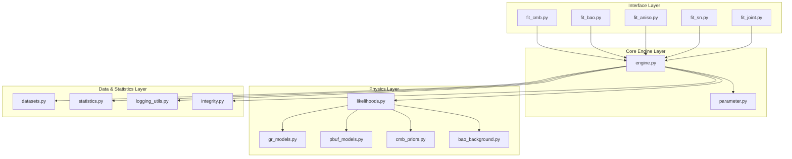

# Design Document

## Overview

The PBUF cosmology refactor transforms the current organically-grown pipeline into a unified, modular architecture centered around a shared optimization engine. The design eliminates code duplication by centralizing parameter handling, likelihood computations, and statistical analysis while maintaining strict physical consistency across all cosmological blocks (CMB, BAO, SN, Joint).

The architecture follows a layered approach:
- **Core Engine Layer**: Unified optimization and orchestration
- **Physics Layer**: Centralized parameter construction and likelihood functions  
- **Data Layer**: Unified dataset loading and validation
- **Statistics Layer**: Consistent metrics computation (χ², AIC, BIC)
- **Interface Layer**: Thin wrapper scripts for individual fitters

## Architecture

### High-Level System Architecture



### Directory Structure

```
pipelines/
├── fit_core/
│   ├── __init__.py
│   ├── engine.py           # Unified optimization engine
│   ├── parameter.py        # Centralized parameter construction
│   ├── likelihoods.py      # Block likelihood definitions
│   ├── datasets.py         # Unified dataset loader abstraction
│   ├── statistics.py       # χ², AIC, BIC, dof calculations
│   ├── logging_utils.py    # Standardized run logging & diagnostics
│   └── integrity.py        # Consistency tests and validation
├── fit_joint.py            # Joint fitting wrapper
├── fit_cmb.py              # CMB fitting wrapper
├── fit_bao.py              # BAO fitting wrapper
├── fit_aniso.py            # Anisotropic BAO fitting wrapper
├── fit_sn.py               # Supernova fitting wrapper
└── legacy/                 # Preserved original implementations
```

## Components and Interfaces

### 1. Core Engine (engine.py)

**Purpose**: Central orchestration and optimization engine used by all fitters.

**Key Functions**:
```python
def run_fit(model: str, datasets: List[str], mode: str = "joint", 
           overrides: Dict = None, optimizer_config: Dict = None) -> Dict
```

**Responsibilities**:
- Build parameter sets via `parameter.build_params()`
- Dispatch appropriate likelihood functions for each dataset
- Sum χ² contributions across all requested blocks
- Execute optimization using scipy.optimize or differential evolution
- Compute statistical metrics (AIC, BIC, degrees of freedom)
- Log standardized results and diagnostics
- Return structured results dictionary

**Interface Contract**:
- Input: Model type ("lcdm", "pbuf"), dataset list, mode, optional overrides
- Output: Complete results dictionary with parameters, χ² breakdown, metrics
- Guarantees: Deterministic results for identical inputs, consistent parameter handling

### 2. Parameter Management (parameter.py)

**Purpose**: Single source of truth for all cosmological parameters.

**Key Functions**:
```python
def build_params(model: str, overrides: Dict = None) -> Dict
def get_defaults(model: str) -> Dict
def validate_params(params: Dict) -> bool
```

**Parameter Defaults**:
```python
DEFAULTS = {
    "lcdm": {
        "H0": 67.4,           # km/s/Mpc
        "Om0": 0.315,         # Matter density fraction
        "Obh2": 0.02237,      # Physical baryon density
        "ns": 0.9649,         # Scalar spectral index
        "Neff": 3.046,        # Effective neutrino species
        "Tcmb": 2.7255,       # CMB temperature (K)
        "recomb_method": "PLANCK18"
    },
    "pbuf": {
        "alpha": 5e-4,        # Elasticity amplitude
        "Rmax": 1e9,          # Saturation length scale
        "eps0": 0.7,          # Elasticity bias term
        "n_eps": 0.0,         # Evolution exponent
        "k_sat": 0.9762       # Saturation coefficient
    }
}
```

**Responsibilities**:
- Store and manage default parameter values for ΛCDM and PBUF models
- Apply parameter overrides consistently
- Interface with `cmb_priors.prepare_background_params()` for derived quantities
- Ensure parameter validation and unit consistency
- Support extensibility for new cosmological models

### 3. Likelihood Functions (likelihoods.py)

**Purpose**: Pure functions computing χ² and predictions for each observational block.

**Key Functions**:
```python
def likelihood_cmb(params: Dict, data: Dict) -> Tuple[float, Dict]
def likelihood_bao(params: Dict, data: Dict) -> Tuple[float, Dict]  
def likelihood_bao_ani(params: Dict, data: Dict) -> Tuple[float, Dict]
def likelihood_sn(params: Dict, data: Dict) -> Tuple[float, Dict]
```

**Implementation Details**:

**CMB Likelihood**:
- Uses `cmb_priors.distance_priors()` for theoretical predictions
- Computes shift parameter R, acoustic scale ℓ_A, angular scale θ*
- Applies recombination redshift z* (PLANCK18 method by default)
- Returns χ² via `chi2_generic()` and prediction dictionary

**BAO Likelihood (Isotropic)**:
- Uses `bao_background.bao_distance_ratios()` for D_V/r_s predictions
- Applies drag epoch z_d from Eisenstein & Hu (1998)
- Handles multiple redshift bins consistently

**BAO Likelihood (Anisotropic)**:
- Uses `bao_background.bao_anisotropic_ratios()` for D_M/r_s and H*r_s
- Separates transverse and radial BAO measurements
- Maintains covariance structure for correlated measurements

**Supernova Likelihood**:
- Uses `gr_models.mu()` for distance modulus predictions
- Handles Pantheon+ dataset format and systematic uncertainties
- Applies magnitude offset marginalization if configured

### 4. Dataset Management (datasets.py)

**Purpose**: Unified interface for loading and validating observational datasets.

**Key Functions**:
```python
def load_dataset(name: str) -> Dict
def validate_dataset(data: Dict, expected_format: str) -> bool
def get_dataset_info(name: str) -> Dict
```

**Supported Datasets**:
- `"cmb"`: Planck 2018 distance priors (R, ℓ_A, θ*)
- `"bao"`: Mixed BAO compilation (isotropic D_V/r_s ratios)
- `"bao_ani"`: Anisotropic BAO measurements (D_M/r_s, H*r_s)
- `"sn"`: Pantheon+ supernova compilation

**Responsibilities**:
- Wrap existing `dataio.loaders` functions
- Ensure consistent data format and labeling across all blocks
- Validate covariance matrix properties (positive definiteness)
- Provide metadata about dataset characteristics (redshift ranges, number of points)

### 5. Statistics Engine (statistics.py)

**Purpose**: Centralized computation of all statistical metrics and goodness-of-fit measures.

**Key Functions**:
```python
def chi2_generic(predictions: Dict, observations: Dict, covariance: np.ndarray) -> float
def compute_metrics(chi2: float, n_params: int, datasets: List[str]) -> Dict
def compute_dof(datasets: List[str], n_params: int) -> int
def delta_aic(aic1: float, aic2: float) -> float
```

**Metric Definitions**:
- **χ²**: `(pred - obs)ᵀ C⁻¹ (pred - obs)` using consistent matrix operations
- **AIC**: `χ² + 2k` where k is number of free parameters
- **BIC**: `χ² + k ln(N)` where N is total number of data points
- **Degrees of Freedom**: `N_data - N_params` across all datasets
- **p-value**: From χ² distribution with computed degrees of freedom

**Responsibilities**:
- Ensure identical statistical computations across all fitters
- Handle covariance matrix operations consistently
- Provide model comparison utilities (ΔAIC, evidence ratios)
- Support both individual block and joint fitting statistics

### 6. Logging and Diagnostics (logging_utils.py)

**Purpose**: Standardized logging, diagnostics, and result reporting.

**Key Functions**:
```python
def log_run(model: str, mode: str, results: Dict, metrics: Dict) -> None
def log_diagnostics(params: Dict, predictions: Dict) -> None
def format_results_table(results: Dict) -> str
```

**Standard Log Format**:
```
[RUN] model=pbuf block=cmb χ²=1.79 AIC=7.79 params={H0:67.4, Om0:0.315, ...}
[PRED] z*=1089.9 r_s=144.3 D_M=13864.3 l_A=301.845 theta*=1.04092
[CHECK] H_ratio=[1.000,1.000,1.000] covariance_min_eigen=2.1e-5
```

**Responsibilities**:
- Provide consistent diagnostic output across all fitters
- Log parameter values, predictions, and fit quality metrics
- Include physics consistency checks (H(z) ratios, recombination values)
- Support both human-readable and machine-parseable output formats

### 7. Integrity Validation (integrity.py)

**Purpose**: Optional consistency tests and physics validation checks.

**Key Functions**:
```python
def verify_h_ratios(params: Dict, redshifts: List[float]) -> bool
def verify_recombination(params: Dict, reference: float = 1089.80) -> bool
def verify_covariance_matrices(datasets: List[str]) -> bool
def run_integrity_suite(params: Dict, datasets: List[str]) -> Dict
```

**Validation Tests**:
- **H(z) Consistency**: Compare PBUF vs ΛCDM Hubble ratios at test redshifts
- **Recombination Reference**: Verify z* computation against Planck 2018 baseline
- **Sound Horizon**: Check r_s(z_d) against Eisenstein & Hu reference values
- **Covariance Properties**: Ensure positive definiteness and proper conditioning
- **Unit Consistency**: Verify dimensional analysis across all computations

## Data Models

### Parameter Dictionary Structure

```python
{
    # Core cosmological parameters
    "H0": float,              # Hubble constant (km/s/Mpc)
    "Om0": float,             # Matter density fraction
    "Obh2": float,            # Physical baryon density
    "ns": float,              # Scalar spectral index
    "Neff": float,            # Effective neutrino species
    "Tcmb": float,            # CMB temperature (K)
    
    # PBUF-specific parameters (if model="pbuf")
    "alpha": float,           # Elasticity amplitude
    "Rmax": float,            # Saturation length scale  
    "eps0": float,            # Elasticity bias term
    "n_eps": float,           # Evolution exponent
    "k_sat": float,           # Saturation coefficient
    
    # Derived quantities (computed by prepare_background_params)
    "Omh2": float,            # Physical matter density
    "Orh2": float,            # Physical radiation density
    "z_recomb": float,        # Recombination redshift
    "z_drag": float,          # Drag epoch redshift
    "r_s_drag": float,        # Sound horizon at drag epoch
    
    # Model metadata
    "model_class": str,       # "lcdm" or "pbuf"
    "recomb_method": str      # "PLANCK18", "HS96", or "EH98"
}
```

### Results Dictionary Structure

```python
{
    "params": Dict,           # Final optimized parameters
    "results": {              # Per-block results
        "cmb": {
            "chi2": float,
            "predictions": Dict,
            "residuals": np.ndarray
        },
        "bao": {...},
        "sn": {...}
    },
    "metrics": {              # Overall fit statistics
        "total_chi2": float,
        "aic": float,
        "bic": float,
        "dof": int,
        "p_value": float
    },
    "diagnostics": {          # Physics consistency checks
        "h_ratios": List[float],
        "recomb_check": bool,
        "covariance_status": str
    }
}
```

## Error Handling

### Parameter Validation
- Invalid parameter ranges trigger `ValueError` with specific bounds
- Missing required parameters raise `KeyError` with parameter name
- Unit inconsistencies log warnings and apply automatic conversions where possible

### Numerical Stability
- Covariance matrix conditioning checks before inversion
- Overflow protection in exponential functions (PBUF saturation terms)
- Graceful handling of optimization convergence failures

### Physics Consistency
- H(z) ratio checks with configurable tolerance (default 1e-4)
- Recombination redshift validation against reference values
- Sound horizon computation verification with fallback methods

### Data Validation
- Dataset format verification before likelihood computation
- Covariance matrix positive definiteness checks
- Missing data handling with appropriate error messages

## Testing Strategy

### Unit Testing Framework
- **Parameter Module**: Test default values, override application, validation logic
- **Likelihood Functions**: Verify χ² computations against analytical cases
- **Statistics Module**: Test AIC/BIC calculations, degrees of freedom counting
- **Dataset Loading**: Validate data format consistency and error handling

### Integration Testing
- **End-to-End Parity**: Compare new vs legacy system outputs within 1e-6 tolerance
- **Cross-Block Consistency**: Verify identical parameter handling across CMB/BAO/SN
- **Joint vs Individual**: Ensure joint fitting equals sum of individual block χ²

### Physics Validation Tests
- **ΛCDM Recovery**: Verify PBUF reduces to ΛCDM when k_sat → 1
- **Recombination Methods**: Test HS96, EH98, PLANCK18 consistency
- **Distance Relations**: Validate D_L, D_A, D_V relationships

### Performance Testing
- **Optimization Speed**: Benchmark convergence times vs legacy implementation
- **Memory Usage**: Monitor parameter dictionary and result storage efficiency
- **Numerical Precision**: Verify stable results across different optimization methods

### Regression Testing
- **Reference Datasets**: Maintain frozen test cases with known good outputs
- **Parameter Sensitivity**: Test robustness to small parameter perturbations
- **Edge Cases**: Validate behavior at parameter boundaries and extreme values

The testing strategy ensures both numerical accuracy and scientific validity while maintaining backward compatibility during the migration period.