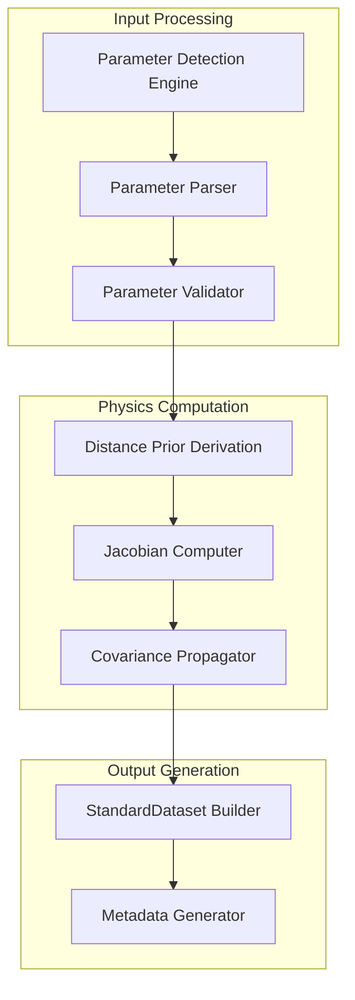

# CMB Raw Parameter Integration - Module Documentation

## Overview

The CMB (Cosmic Microwave Background) derivation module has been enhanced with advanced raw parameter processing capabilities. This module can now process Planck-style cosmological parameter files directly, computing distance priors internally using PBUF background integrators, while maintaining full backward compatibility with pre-computed distance prior files.

## Architecture

### Core Components



### Processing Workflow

1. **Parameter Detection**: Automatically detect raw cosmological parameters in registry entries
2. **Format Classification**: Identify file format (CSV, JSON, NumPy, text) and structure
3. **Parameter Parsing**: Extract and normalize parameter names using fuzzy matching
4. **Validation**: Check parameter ranges, numerical stability, and completeness
5. **Distance Prior Derivation**: Compute R, ℓₐ, θ* using PBUF background integrators
6. **Covariance Propagation**: Transform parameter uncertainties to derived observables
7. **Output Construction**: Build StandardDataset with comprehensive metadata

## API Reference

### Main Processing Function

```python
def process_cmb_dataset(
    registry_entry: Dict[str, Any], 
    config: Optional[CMBConfig] = None
) -> StandardDataset:
    """
    Main CMB processing function with comprehensive error handling.
    
    Args:
        registry_entry: Registry entry containing dataset metadata and sources
        config: CMB processing configuration (uses defaults if None)
        
    Returns:
        StandardDataset: Processed CMB data in standardized format
        
    Raises:
        ParameterDetectionError: If raw parameters cannot be detected/parsed
        ParameterValidationError: If parameters fail validation
        DerivationError: If distance prior computation fails
        CovarianceError: If covariance propagation fails
    """
```

### Parameter Detection

```python
def detect_raw_parameters(registry_entry: Dict[str, Any]) -> Optional[RawParameterInfo]:
    """
    Detect if registry entry contains raw cosmological parameters.
    
    Scans registry metadata and file listings to identify parameter files
    containing H₀, Ωₘ, Ωᵦh², nₛ, τ rather than pre-computed distance priors.
    
    Args:
        registry_entry: Registry entry dictionary
        
    Returns:
        RawParameterInfo if raw parameters detected, None otherwise
    """
```

### Parameter Parsing

```python
def parse_parameter_file(file_path: str, format_type: ParameterFormat) -> ParameterSet:
    """
    Parse parameter file and return normalized ParameterSet.
    
    Supports multiple formats and handles various naming conventions
    through fuzzy matching.
    
    Args:
        file_path: Path to parameter file
        format_type: Detected file format
        
    Returns:
        ParameterSet with normalized cosmological parameters
    """
```

### Distance Prior Derivation

```python
def compute_distance_priors(
    params: ParameterSet, 
    z_recomb: float = 1089.8
) -> DistancePriors:
    """
    Compute CMB distance priors from cosmological parameters.
    
    Uses PBUF background integrators for consistent calculations
    with BAO and SN modules.
    
    Args:
        params: Cosmological parameters (H₀, Ωₘ, Ωᵦh², nₛ, τ)
        z_recomb: Recombination redshift
        
    Returns:
        DistancePriors containing R, ℓₐ, θ* values
    """
```

### Covariance Propagation

```python
def compute_jacobian(
    params: ParameterSet, 
    z_recomb: float, 
    step_size: float = 1e-6
) -> np.ndarray:
    """
    Compute numerical Jacobian for covariance propagation.
    
    Calculates ∂(R,ℓₐ,θ*)/∂(H₀,Ωₘ,Ωᵦh²,nₛ,τ) using central differences.
    
    Args:
        params: Parameter values around which to compute derivatives
        z_recomb: Recombination redshift
        step_size: Finite difference step size
        
    Returns:
        Jacobian matrix (3×5 or 3×6 depending on parameters)
    """
```

```python
def propagate_covariance(param_cov: np.ndarray, jacobian: np.ndarray) -> np.ndarray:
    """
    Propagate parameter covariance to derived observables.
    
    Uses linear error propagation: C_derived = J × C_params × J^T
    
    Args:
        param_cov: Parameter covariance matrix
        jacobian: Jacobian matrix from compute_jacobian
        
    Returns:
        Derived covariance matrix for distance priors
    """
```

## Data Models

### ParameterSet

```python
@dataclass
class ParameterSet:
    """Cosmological parameter container with validation."""
    H0: float                        # Hubble constant [km/s/Mpc]
    Omega_m: float                   # Matter density parameter
    Omega_b_h2: float               # Baryon density × h²
    n_s: float                      # Scalar spectral index
    tau: float                      # Optical depth to reionization
    A_s: Optional[float] = None     # Scalar amplitude (if available)
    
    def validate(self) -> ValidationResult:
        """Validate parameters against physical bounds."""
        
    @classmethod
    def from_dict(cls, params: Dict[str, float]) -> 'ParameterSet':
        """Create from parameter dictionary."""
```

### DistancePriors

```python
@dataclass
class DistancePriors:
    """CMB distance prior container."""
    R: float                        # Shift parameter
    l_A: float                      # Acoustic scale
    Omega_b_h2: float              # Baryon density (pass-through)
    theta_star: float              # Angular scale
    
    @property
    def values(self) -> np.ndarray:
        """Return as array for numerical operations."""
```

### CMBConfig

```python
@dataclass
class CMBConfig:
    """CMB processing configuration."""
    use_raw_parameters: bool = True          # Enable raw parameter processing
    z_recombination: float = 1089.8         # Recombination redshift
    jacobian_step_size: float = 1e-6       # Numerical differentiation step
    validation_tolerance: float = 1e-8      # Covariance validation tolerance
    fallback_to_legacy: bool = True         # Auto-fallback if raw params unavailable
    cache_computations: bool = True         # Cache expensive computations
```

## Configuration Integration

### Environment Variables

```bash
# Enable/disable raw parameter processing
export PBUF_CMB_USE_RAW_PARAMETERS=true

# Set recombination redshift
export PBUF_CMB_Z_RECOMBINATION=1089.8

# Configure numerical differentiation
export PBUF_CMB_JACOBIAN_STEP_SIZE=1e-6

# Enable computation caching
export PBUF_CMB_CACHE_ENABLED=true
```

### Configuration File

```json
{
  "cmb_processing": {
    "use_raw_parameters": true,
    "z_recombination": 1089.8,
    "jacobian_step_size": 1e-6,
    "validation_tolerance": 1e-8,
    "fallback_to_legacy": true,
    "cache_computations": true,
    "performance_monitoring": true
  }
}
```

### Programmatic Configuration

```python
from pipelines.data_preparation.core.cmb_config_integration import (
    get_cmb_config, set_cmb_config, update_cmb_config
)

# Get current configuration
config = get_cmb_config()

# Update specific settings
update_cmb_config({
    "use_raw_parameters": True,
    "z_recombination": 1090.0,
    "jacobian_step_size": 1e-5
})

# Set complete new configuration
new_config = CMBConfig(
    use_raw_parameters=True,
    z_recombination=1089.8,
    jacobian_step_size=1e-6
)
set_cmb_config(new_config)
```

## Parameter Name Mapping

The module supports flexible parameter name matching through aliases:

```python
PARAMETER_ALIASES = {
    'H0': ['H0', 'h0', 'hubble', 'H_0', 'h_0', 'hubble_constant'],
    'Omega_m': ['Omega_m', 'Om0', 'omega_m', 'OmegaM', 'Ωm', 'omega_matter'],
    'Omega_b_h2': ['Omega_b_h2', 'omegabh2', 'omega_b_h2', 'Ωbh²', 'omega_baryon_h2'],
    'n_s': ['n_s', 'ns', 'n_scalar', 'spectral_index', 'scalar_spectral_index'],
    'tau': ['tau', 'τ', 'tau_reio', 'optical_depth', 'tau_optical'],
    'A_s': ['A_s', 'As', 'A_scalar', 'scalar_amplitude', 'amplitude_scalar']
}
```

## Validation Rules

### Parameter Bounds

```python
PARAMETER_BOUNDS = {
    'H0': (50.0, 80.0),           # km/s/Mpc
    'Omega_m': (0.1, 0.5),        # Matter density
    'Omega_b_h2': (0.01, 0.05),   # Baryon density
    'n_s': (0.9, 1.1),            # Spectral index
    'tau': (0.01, 0.15),          # Optical depth
    'A_s': (1e-10, 5e-9)          # Scalar amplitude
}
```

### Covariance Matrix Validation

- **Symmetry**: |C - C^T| < tolerance
- **Positive-definiteness**: All eigenvalues > 0
- **Numerical stability**: Condition number monitoring
- **Dimension consistency**: Matrix size matches parameter count

## Error Handling

### Exception Hierarchy

```python
class CMBProcessingError(Exception):
    """Base exception for CMB processing errors."""

class ParameterDetectionError(CMBProcessingError):
    """Raised when raw parameters cannot be detected or parsed."""

class ParameterValidationError(CMBProcessingError):
    """Raised when parameters fail validation checks."""

class DerivationError(CMBProcessingError):
    """Raised when distance prior computation fails."""

class CovarianceError(CMBProcessingError):
    """Raised when covariance propagation fails."""

class NumericalInstabilityError(CMBProcessingError):
    """Raised when numerical computations become unstable."""
```

### Error Recovery

1. **Automatic Fallback**: Falls back to legacy distance-prior mode if raw parameters unavailable
2. **Graceful Degradation**: Uses diagonal covariance if matrix propagation fails
3. **Detailed Diagnostics**: Provides specific error messages and suggested actions
4. **Comprehensive Logging**: Records all processing steps for debugging

## Performance Considerations

### Computational Complexity

- **Parameter Detection**: O(1) - Fast metadata scanning
- **Parameter Parsing**: O(n) - Linear in file size
- **Distance Prior Derivation**: O(1) - Fixed number of integrations
- **Jacobian Computation**: O(p) - Linear in parameter count
- **Covariance Propagation**: O(p²) - Matrix multiplication

### Memory Usage

- **Parameter Storage**: Minimal (< 1KB per parameter set)
- **Covariance Matrices**: O(p²) where p is parameter count (typically 5-6)
- **Intermediate Results**: Cached for repeated computations
- **Background Integrators**: Reuse existing PBUF infrastructure

### Optimization Features

- **Computation Caching**: Avoid repeated expensive calculations
- **Adaptive Step Sizes**: Optimize numerical differentiation accuracy/speed
- **Sparse Matrix Support**: Efficient handling of large covariance matrices
- **Parallel Processing**: Independent parameter sets can be processed concurrently

## Integration Points

### PBUF Background Integrators

```python
from pipelines.data_preparation.derivation.cmb_background import (
    BackgroundIntegrator,
    compute_sound_horizon,
    create_background_integrator
)

# Consistent with BAO and SN calculations
integrator = create_background_integrator(params)
comoving_distance = integrator.comoving_distance(z_recombination)
sound_horizon = compute_sound_horizon(params, z_recombination)
```

### Dataset Registry

- Registry entries must include parameter file metadata
- Support for multiple file formats in single entry
- Covariance matrix linking and validation
- Provenance tracking through processing chain

### Fitting Pipelines

- StandardDataset output maintains exact compatibility
- No changes required in existing fitting code
- Metadata provides processing transparency
- Error handling preserves existing behavior

## Backward Compatibility

### Legacy Mode Support

The module automatically detects whether to use raw parameter processing or legacy distance-prior mode:

```python
# Automatic detection and fallback
def process_cmb_dataset(registry_entry, config=None):
    raw_params = detect_raw_parameters(registry_entry)
    
    if raw_params and config.use_raw_parameters:
        # Use new raw parameter processing
        return process_raw_parameters(raw_params, config)
    else:
        # Fall back to legacy distance-prior mode
        return process_legacy_distance_priors(registry_entry)
```

### Migration Path

1. **Phase 1**: Enable raw parameter processing alongside legacy mode
2. **Phase 2**: Gradually migrate datasets to raw parameter format
3. **Phase 3**: Deprecate legacy mode while maintaining compatibility
4. **Phase 4**: Full transition to raw parameter processing

### Compatibility Testing

- All existing CMB datasets continue to work unchanged
- Output format identical for equivalent inputs
- Metadata indicates processing method used
- Performance impact minimal for legacy datasets

## Monitoring and Diagnostics

### Logging Integration

```python
import logging

# Configure CMB-specific logging
cmb_logger = logging.getLogger('data_preparation.cmb')
cmb_logger.setLevel(logging.INFO)

# Processing steps are automatically logged
# - Parameter detection results
# - Validation outcomes
# - Computation performance
# - Error diagnostics
```

### Performance Metrics

```python
# Automatic performance monitoring
processing_metrics = {
    "parameter_detection_time": 0.001,
    "parsing_time": 0.005,
    "validation_time": 0.002,
    "derivation_time": 0.150,
    "jacobian_computation_time": 0.050,
    "covariance_propagation_time": 0.010,
    "total_processing_time": 0.218,
    "memory_peak_mb": 12.5
}
```

### Health Monitoring

```python
# System health checks during processing
health_status = {
    "numerical_stability": "stable",
    "covariance_condition_number": 1.2e3,
    "parameter_validation_passed": True,
    "background_integrator_status": "operational",
    "memory_usage_within_limits": True
}
```

This documentation provides comprehensive coverage of the CMB raw parameter integration capabilities, enabling users to effectively utilize the new features while maintaining compatibility with existing workflows.