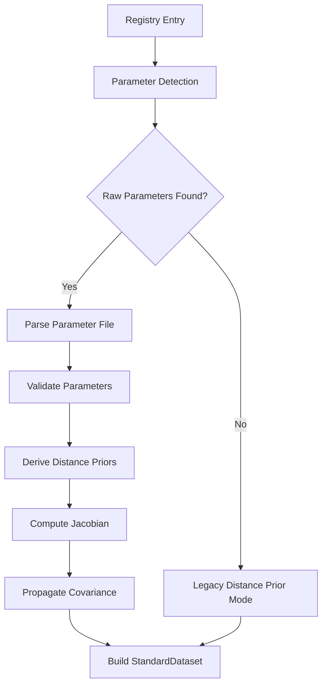

# PBUF Data Preparation & Derivation Framework

The PBUF Data Preparation & Derivation Framework provides a unified layer for transforming raw cosmological datasets into standardized, analysis-ready formats with comprehensive validation and provenance tracking.

## Overview

This framework extends the existing PBUF infrastructure by introducing systematic data processing, validation, and provenance tracking for all dataset types. It operates as middleware between the dataset registry and fitting pipelines.

## Architecture

```
[Raw Data Sources] → [Dataset Registry] → [Data Preparation Framework] → [Fit Pipelines]
                                                     ↓
                                            [Provenance Registry]
```

## Core Components

### 1. StandardDataset Schema (`core/schema.py`)
- Unified internal format for all cosmological datasets
- Fields: `z` (redshift), `observable`, `uncertainty`, `covariance`, `metadata`
- Built-in validation methods for schema, numerical integrity, and covariance matrices

### 2. DerivationModule Interface (`core/interfaces.py`)
- Abstract base class for dataset-specific transformation logic
- Plugin-like architecture for extensibility
- Methods: `validate_input()`, `derive()`, `get_transformation_summary()`

### 3. ValidationEngine (`core/validation.py`)
- Multi-stage validation system
- Configurable validation rules
- Comprehensive error reporting with suggested remediation actions

### 4. DataPreparationFramework (`engine/preparation_engine.py`)
- Main orchestration engine
- Coordinates dataset loading, transformation, and validation
- Error handling and recovery mechanisms

### 5. CMB Raw Parameter Integration (`derivation/cmb_derivation.py`)
- Advanced CMB processing with raw parameter support
- Automatic detection of Planck-style parameter files
- Distance prior derivation using PBUF background integrators
- Covariance propagation through numerical Jacobian computation
- Backward compatibility with pre-computed distance priors

## Usage

### Basic Usage

```python
from pipelines.data_preparation import DataPreparationFramework, StandardDataset

# Initialize framework
framework = DataPreparationFramework()

# Register derivation modules (will be implemented in task 5)
# framework.register_derivation_module(sn_module)

# Prepare dataset
dataset = framework.prepare_dataset(
    "sn_pantheon",
    raw_data_path=Path("raw_data.txt"),
    metadata={"source": "Pantheon", "version": "1.0"}
)

# Access standardized data
print(f"Dataset has {len(dataset.z)} data points")
print(f"Redshift range: {dataset.z.min():.3f} - {dataset.z.max():.3f}")
```

### Validation

```python
from pipelines.data_preparation.core.validation import ValidationEngine

# Create validation engine
validator = ValidationEngine()

# Validate dataset
results = validator.validate_dataset(dataset, "my_dataset")
print(f"Validation passed: {results['validation_passed']}")
```

## Supported Dataset Types

The framework is designed to support:
- **SN**: Supernova distance measurements
- **BAO**: Baryon Acoustic Oscillation measurements (isotropic/anisotropic)
- **CMB**: Cosmic Microwave Background distance priors (with raw parameter processing)
- **CC**: Cosmic Chronometers H(z) measurements
- **RSD**: Redshift Space Distortion growth rate measurements

### CMB Processing Workflow

The CMB module supports two processing modes:

#### Raw Parameter Mode (New)


**Features:**
- Automatic detection of Planck-style parameter files (CSV, JSON, NumPy, text)
- Fuzzy parameter name matching (H0/h0/hubble, Omega_m/Om0/omega_m, etc.)
- Distance prior derivation: R = √(Ωₘ H₀²) × r(z*)/c, ℓₐ = π × r(z*)/rₛ(z*), θ* = rₛ(z*)/r(z*)
- Numerical Jacobian computation for covariance propagation
- Integration with PBUF background integrators for consistency

#### Legacy Distance Prior Mode
- Processes pre-computed distance priors from existing files
- Maintains full backward compatibility
- No changes required for existing datasets

**Configuration:**
```python
from pipelines.data_preparation.derivation.cmb_models import CMBConfig

config = CMBConfig(
    use_raw_parameters=True,        # Enable raw parameter processing
    z_recombination=1089.8,         # Recombination redshift
    jacobian_step_size=1e-6,        # Numerical differentiation step
    fallback_to_legacy=True         # Auto-fallback if needed
)
```

## Testing

Run the comprehensive test suite:

```bash
python -m pytest pipelines/data_preparation/tests/ -v
```

The test suite includes:
- Unit tests for all core components (75 tests)
- Integration tests for end-to-end workflows (5 tests)
- Validation tests for error handling and edge cases

## Requirements Satisfied

This implementation satisfies the following requirements from the specification:

- **1.1**: Standardized internal format with consistent schema
- **2.2**: Extensible plugin-like architecture for derivation modules
- **4.1**: Comprehensive validation at each processing stage

## Next Steps

The framework is ready for:
1. Registry integration (Task 2)
2. Dataset-specific derivation modules (Task 5)
3. Output manager and format conversion (Task 6)
4. Integration with existing PBUF infrastructure (Task 7)

## Directory Structure

```
pipelines/data_preparation/
├── __init__.py                 # Package initialization
├── README.md                   # This file
├── core/                       # Core framework components
│   ├── __init__.py
│   ├── schema.py              # StandardDataset schema
│   ├── interfaces.py          # Abstract base classes
│   └── validation.py          # Validation engine
├── engine/                     # Processing engine
│   ├── __init__.py
│   └── preparation_engine.py  # Main orchestration
├── derivation/                 # Dataset-specific modules (to be implemented)
│   └── __init__.py
└── tests/                      # Comprehensive test suite
    ├── __init__.py
    ├── test_schema.py
    ├── test_interfaces.py
    ├── test_validation.py
    ├── test_preparation_engine.py
    └── test_integration.py
```